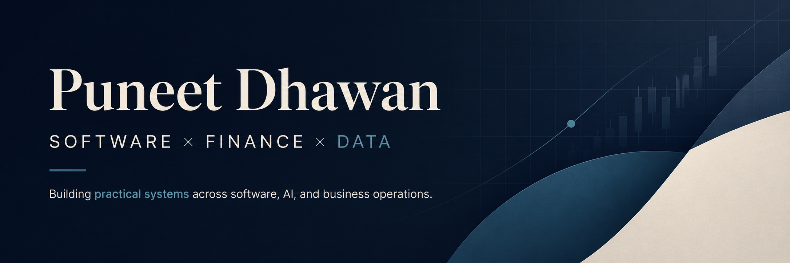

  

  <strong>Computer Science + Finance @ University of Calgary</strong>

  Building practical systems across full-stack software, applied AI, data, finance, and business operations.

  
  
  

---

## Selected Work

### [TimeRipple](https://github.com/PuneetDhawan1/CursorHackathon)

**Cursor Hackathon Finalist**

AI scheduling application that adapts a user's day when plans change, models the ripple effects of delays, and generates realistic recovery plans.

---

### Retail Operations Platform

Private production system built for a real jewellery business.

Connects sales, inventory, barcode tracking, invoicing, customers, expenses, layaways, metal pricing, and financial reporting in one operational platform.

Source code is private to protect business data and proprietary workflows.

---

### [ML Equity Signal System](YOUR_ML_PROJECT_URL)

Machine-learning research pipeline for testing equity signals using five years of historical market data.

Includes feature engineering, triple-barrier labelling, walk-forward validation, and out-of-sample evaluation.

---

### [World Economic Data Dashboard](YOUR_WORLD_DATA_PROJECT_URL)

Interactive analytics project exploring GDP, population, life expectancy, emissions, and development trends across more than 50 countries.

---

### [OMG Gaming Simulator](YOUR_OMG_PROJECT_URL)

Java gaming-platform simulator developed through a collaborative 25-person software-development lifecycle.

Applied object-oriented design, UML modelling, modular architecture, testing, and Agile development practices.

---

## Languages

  

`SQL` `VBA`

## Frameworks & Applications

  

## Data, Databases & Engineering

  

`Pandas` `NumPy` `scikit-learn` `Power BI` `REST APIs` `Testing` `CI/CD`

---

## GitHub Activity

  
  

  

GitHub statistics reflect public repository activity. Some of my largest production projects are maintained privately.

---

## Currently

- Building production-quality full-stack systems
- Exploring applied AI and financial technology
- Improving my open-source portfolio
- Looking for software, data, AI/ML, and finance opportunities

---

## Beyond Code

I enjoy working where software, finance, and real business operations overlap—especially when the problem is ambiguous and the final product has to work outside of a classroom.

---

  <a href="https://github.com/PuneetDhawan1?tab=repositories">Repositories</a>
  &nbsp;·&nbsp;
  <a href="https://www.linkedin.com/in/puneetdhawanofficial">LinkedIn</a>
  &nbsp;·&nbsp;
  <a href="mailto:puneet.dhawan@ucalgary.ca">Email</a>

