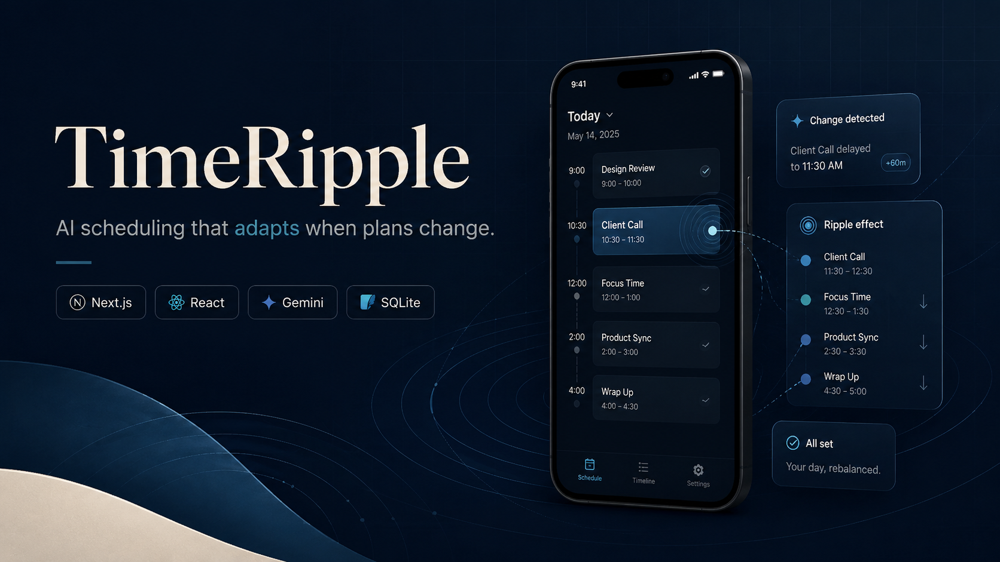
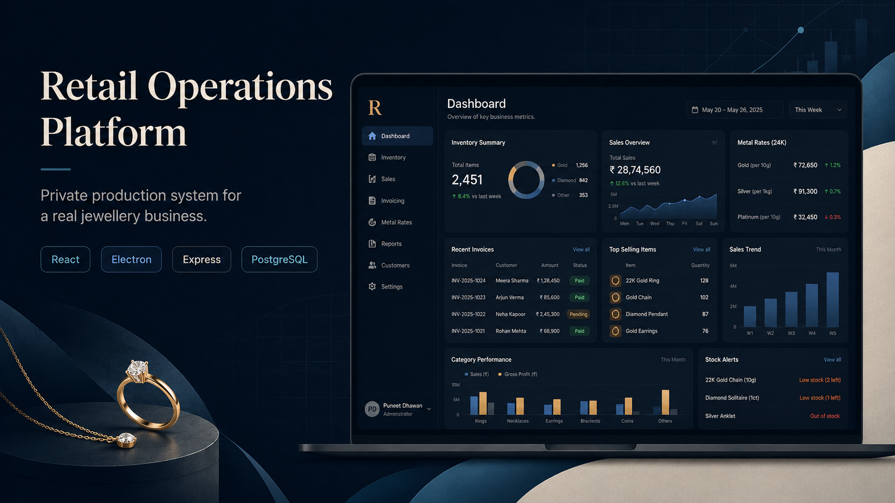
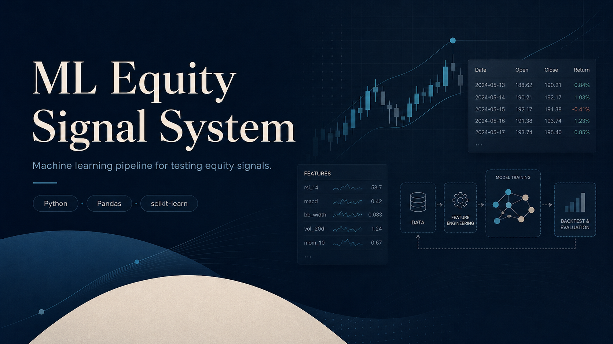
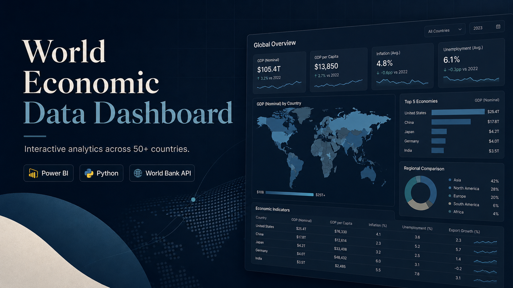

  

  <strong>Computer Science + Finance @ University of Calgary</strong>

  I build practical systems across full-stack software, applied AI, data, and finance.

  <a href="https://www.linkedin.com/in/puneetdhawanofficial">LinkedIn</a>
  &nbsp;·&nbsp;
  <a href="YOUR_PORTFOLIO_URL">Portfolio</a>
  &nbsp;·&nbsp;
  <a href="mailto:puneet.dhawan@ucalgary.ca">Email</a>

---

## Selected Work

### [TimeRipple](https://github.com/PuneetDhawan1/CursorHackathon)

**Cursor Hackathon Finalist**

An AI scheduling application that adapts a user's day when plans change, models the ripple effects of delays, and generates realistic recovery plans.

`Next.js` `React` `Gemini API` `SQLite`

  

---

### Retail Operations Platform

A private production system built for a real jewellery business.

It connects sales, inventory, barcode tracking, invoicing, customers, expenses, layaways, metal pricing, and financial reporting in one platform.

`React` `Electron` `Express.js` `PostgreSQL`

  

Source code is private to protect business data and proprietary workflows.

---

### [ML Equity Signal System](YOUR_ML_PROJECT_URL)

A machine-learning research pipeline for testing equity signals using five years of historical market data.

Includes feature engineering, triple-barrier labelling, walk-forward validation, and out-of-sample evaluation.

`Python` `Pandas` `NumPy` `scikit-learn`

  

---

### [World Economic Data Dashboard](YOUR_WORLD_DATA_PROJECT_URL)

An interactive analytics project exploring GDP, population, life expectancy, emissions, and development trends across more than 50 countries.

`Power BI` `Python` `Pandas` `World Bank API`

  

---

## Technical Toolkit

**Languages**  
`Python` `JavaScript` `SQL` `Java` `C` `C++` `R`

**Applications**  
`React` `Next.js` `Electron` `Express.js` `REST APIs`

**AI & Data**  
`Pandas` `NumPy` `scikit-learn` `TensorFlow` `Keras` `Power BI`

**Databases & Engineering**  
`PostgreSQL` `SQLite` `Git` `GitHub` `Testing` `CI/CD`

---

  <strong>Software shaped by real business problems.</strong>

  <a href="https://github.com/PuneetDhawan1?tab=repositories">View my repositories</a>
  &nbsp;·&nbsp;
  <a href="https://www.linkedin.com/in/puneetdhawanofficial">Connect on LinkedIn</a>

